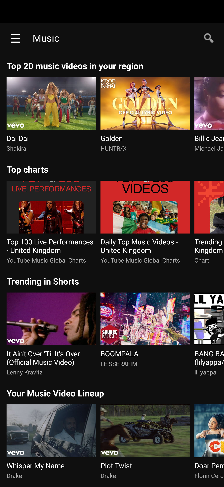
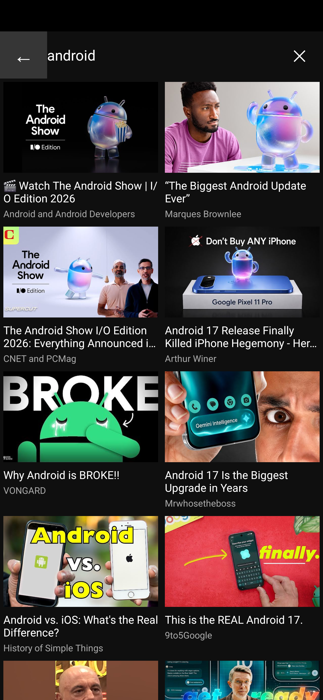
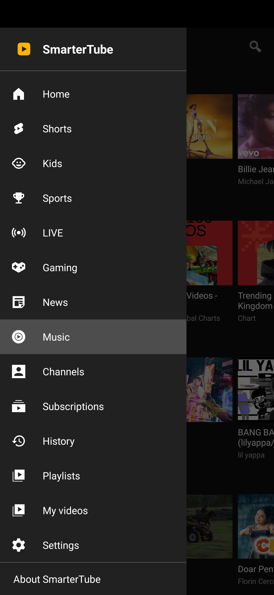
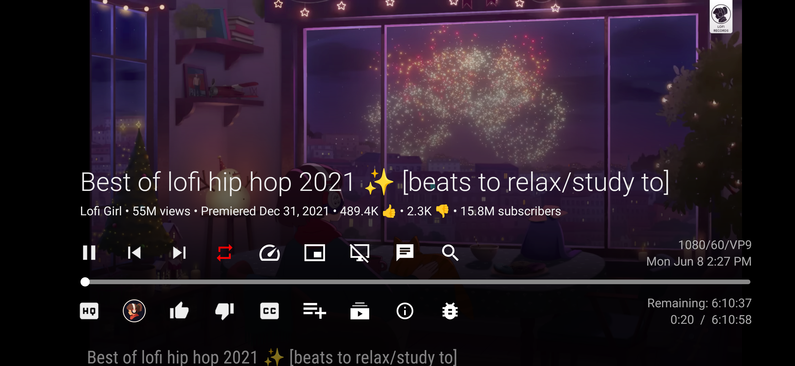

# SmarterTube

**A phone and tablet YouTube client for Android.**

SmarterTube is **not a patched YouTube app and not a wrapper** — it is a native Android phone/tablet UI built on SmartTube's existing YouTube client engine.

It is a fork of [SmartTube](https://github.com/yuliskov/SmartTube) by yuliskov. It adds a native portrait UI — drawer navigation, search, channel pages, settings, sign-in — on top of SmartTube's YouTube client engine, which is merged from upstream unchanged on every release. Upstream SmartTube is TV-only by design; this fork exists for phones and tablets.

> **1.0.** A complete native phone & tablet UI — Home, Search (with voice), Channel, Channel Uploads, Settings, sign-in, and playback — built on SmartTube's YouTube engine. Unlike app-modifiers, these are real native Android screens, not a repackaged YouTube APK.

<p align="center">
  
  &nbsp;&nbsp;&nbsp;
  
  &nbsp;&nbsp;&nbsp;
  
</p>

<p align="center">
  
</p>

---

## Relationship to SmartTube

SmarterTube is an **unofficial fork** of [yuliskov/SmartTube](https://github.com/yuliskov/SmartTube). The playback/client engine, ad blocking, SponsorBlock, Return YouTube Dislike and DeArrow integration — all the under-the-hood behaviour — come from upstream SmartTube, unchanged. This fork's job is to provide a native phone/tablet interface while keeping the upstream structure intact, so non-UI updates can be merged in regularly.

---

## Why this exists

Upstream SmartTube is built for Android TV — a leanback, 10-foot, D-pad interface. Phones and tablets need touch-native navigation instead. SmarterTube adds that UI while preserving upstream compatibility, so engine and feature updates keep flowing in from SmartTube.

| Project | Approach |
|---|---|
| SmartTube (upstream) | Android TV / leanback (10-foot) UI |
| SmarterTube (this fork) | Native phone/tablet touch UI on SmartTube's engine |
| App-patching tools | Patch or modify the official YouTube app itself |

---

## Download

[**GitHub Releases →**](https://github.com/CodeSculptor/SmarterTube/releases)

Pick the APK for your device:

| ABI | Who needs it |
|---|---|
| `arm64-v8a` | Most Android phones made after 2016 |
| `armeabi-v7a` | Older 32-bit devices |
| `x86` | Emulators |
| `universal` | Everything — larger file |

SmarterTube installs as `app.smarttube.mobile` and is **co-installable** with the upstream SmartTube TV build (`app.smarttube`). They do not conflict.

### Auto-updates via Obtainium

SmarterTube is not on any app store. [Obtainium](https://github.com/ImranR98/Obtainium) installs and auto-updates apps straight from their GitHub Releases — no store and no central repository involved:

1. Install Obtainium (itself sideloaded from its own GitHub Releases).
2. **Add App** → paste `https://github.com/CodeSculptor/SmarterTube`.
3. Obtainium tracks each new release automatically; choose the `arm64-v8a` asset (or `universal`) when prompted.

This is the easiest way to stay current.

Official builds are published only on this GitHub Releases page unless another source is explicitly linked here.

### Verifying your download

Every APK on the Releases page carries a **SHA-256 digest**, shown by GitHub next to the asset. After downloading, compare it against the file on your device:

```bash
# Linux/macOS
sha256sum SmarterTube_*.apk
# Windows (PowerShell)
Get-FileHash SmarterTube_*.apk -Algorithm SHA256
```

If the hash matches the one GitHub shows for that asset, the file is intact.

---

## What works

### Phone UI (this fork adds)
- Portrait home screen with drawer navigation (Home, Shorts, Kids, Sports, LIVE, Gaming, News, Music, Channels, Subscriptions, History, Playlists, My videos)
- Search with suggestions and results grid, plus voice search
- Channel pages and channel uploads
- Portrait settings screen
- Sign in / sign out — OAuth device-code flow via in-app browser tab. Switch between multiple accounts with one tap on the toolbar avatar (long-press for account management), or from Settings
- About screen (drawer footer)
- Playback: landscape for regular videos, portrait for Shorts

### From upstream SmartTube (YouTube client engine, unchanged)
- SponsorBlock integration
- Return YouTube Dislike
- DeArrow
- Adjustable playback speed
- Up to 8K / 60fps / HDR
- No Google Play Services required
- No ads

---

## Known limitations & risks

This is alpha software. Install it with that in mind:

- **Alpha status** — expect rough edges, missing screens, and occasional breakage. Not all upstream features are plumbed into the phone UI yet.
- **Upstream / YouTube breakage** — YouTube changes its private APIs without warning, which can break playback at any time. Fixes depend on upstream SmartTube's cadence, then a re-merge here.
- **Sideload only** — not on any app store. Install the APK yourself from Releases, or use [Obtainium](#auto-updates-via-obtainium) to install and auto-update directly from GitHub.
- **No guarantees** — this is an independent fork with no affiliation to Google/YouTube or to upstream SmartTube's author.

Specific gaps:

- **TV / leanback interface** — install [upstream SmartTube](https://github.com/yuliskov/SmartTube) for Android TV boxes and sticks.
- **F-Droid / IzzyOnDroid listing** — not available; use GitHub Releases or [Obtainium](#auto-updates-via-obtainium).
- **Casting / Chromecast** — not currently exposed in the phone UI.

---

## Building

Requires JDK 17 and Android SDK.

```bash
# Debug
./gradlew :smarttubetv:assembleStmobileDebug

# Release (needs keystore.properties + smartertube-release.jks at repo root)
./gradlew :smarttubetv:assembleStmobileRelease
```

Output APKs land in `smarttubetv/build/outputs/apk/stmobile/`.

All phone-specific code lives under `smarttubetv/src/stmobile/` — no changes to `src/main` (TV code) except bug fixes that benefit both targets, which are submitted upstream.

---

## Upstream & maintenance

The YouTube client engine (MediaServiceCore, ExoPlayer, InnerTube API code) is upstream's work and is merged from [yuliskov/SmartTube](https://github.com/yuliskov/SmartTube) on every release. Bug fixes that apply to both the TV and phone targets are submitted upstream rather than kept here — see open PRs for current patches. (Code layout is described under [Building](#building).)

Licensed under [MIT](LICENSE), same as upstream.

---

## Privacy

See [PRIVACY.md](PRIVACY.md).
